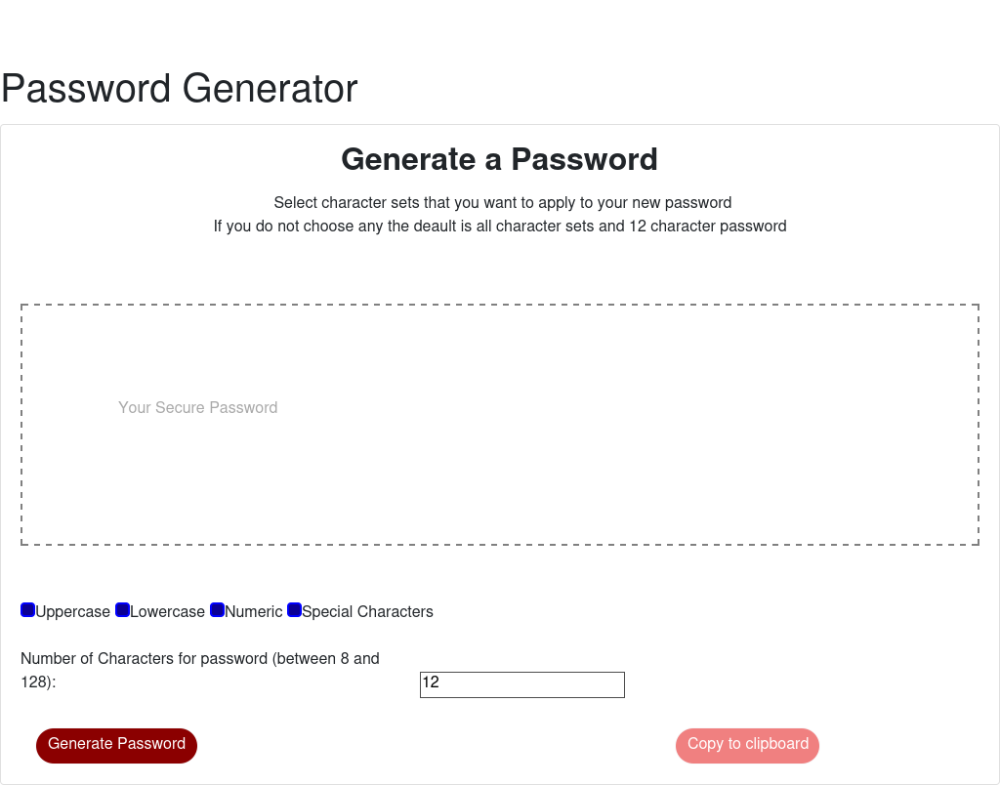

# JavaScript_Password_Generator

# Description
Homework for week 3
This application generates a random password based on user-selected criteria.
The application validates user input for length of password minimum and maximum.
If the user doesn't choose anything on the screen it will default to 12 characters using all the character sets.

# Instructions
Create an application that generates a random password based on user-selected criteria. This app will run in the browser and feature dynamically updated HTML and CSS powered by your JavaScript code.
The user will have a choice to pick the following password criteria:
1. Length (must be between 8 and 128 characters)
2. Character type:
* Special characters   
* Numeric characters   
* Lowercase characters   
* Uppercase characters   

# Psuedocode
build array with upper, lower, numeric, and special char  
  list of special chars https://www.owasp.org/index.php/Password_special_characters  
create form with 4 checkboxes upper, lower, number, special   
add line to get length of password verify between 8 and 128   
create button to generate password after button click   
set up default function if users don't check anything   
build array of charaters using all the users choices   
using random generate a password of the proper length   
display the users new password   
add copy button to copy password to clipboard    

# Website
https://rich30041.github.io/JavaScript_Password_Generator/

# Screenshot of application running

